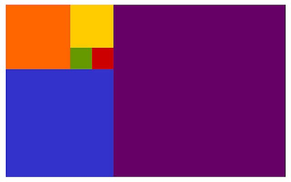

# Frontend Assignment

## Setup
* nodeJS - v14.17.5
* npm - 6.14.14
* vueJS - 2.6.10
## Requirements

* Usage of VueJS and SASS
* Should be finished within one working day
* The repository should be accessible for review

## Description

Recreate the image above, the image is based on the fibonacci sequence. Each
block must show the fibonacci number when clicked. We expect you to use a VueJS
component, an algorithm and SASS.